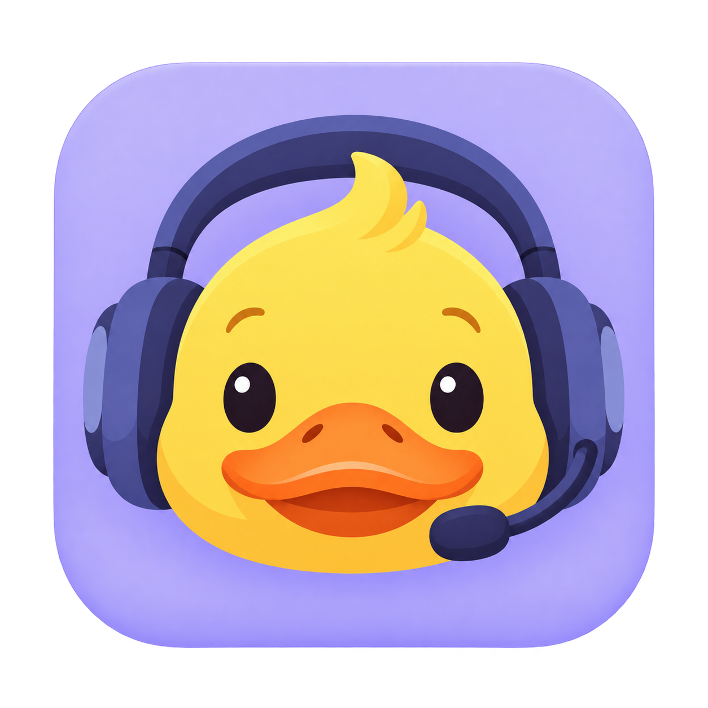

# Codex MicDuck

A small macOS menu bar app that lowers Spotify while Codex uses your microphone, then restores the previous volume when it can do so safely. Your manual volume changes take priority.

**[Website](https://codexmicduck.davolisoftware.com)** · **[Download for Mac](https://github.com/lukedavoli/codex-micduck/releases/latest)** · **[Report an issue](https://github.com/lukedavoli/codex-micduck/issues)**

## Who it is for

- An Apple silicon Mac (M1 or later) running macOS 15 or later.
- The Codex **desktop app**, using dictation or voice.
- The Spotify **desktop app**.

It adjusts Spotify's own volume. It does not change the Mac's system volume, launch Spotify, record audio, or send analytics. Persistent Codex voice sessions remain ducked while Codex keeps its microphone open.

## Install

1. Download the latest `.dmg` from [Releases](https://github.com/lukedavoli/codex-micduck/releases/latest), open it, and drag **Codex MicDuck** into **Applications**.
2. Open Codex MicDuck. Look for the duck in the menu bar; open the app again if a crowded menu bar hides it.
3. With Spotify running, choose **Test Spotify Duck** and allow Codex MicDuck to control Spotify when macOS asks.
4. Start using your microphone in Codex. Choose your preferred Spotify duck volume from the duck menu.

**Launch at Login** is optional. If macOS requests approval, use **System Settings → General → Login Items & Extensions**. If Spotify permission was denied, use **Open Automation Settings…** in the app and enable it under **Privacy & Security → Automation**.

Updates are manual: quit MicDuck, download the new DMG, and replace the app in Applications. To uninstall, turn off Launch at Login, quit, and move the app to the Trash. Local preferences may remain in macOS.

## Privacy and contributions

MicDuck observes microphone-use state through Core Audio; it does not access microphone audio. Settings and a small volume-recovery record stay on your Mac. Recovery only changes Spotify when its volume still matches the value MicDuck applied.

Issues and pull requests are welcome, including compatibility improvements for other devices and platforms. Please describe your macOS, Codex, and Spotify versions when reporting a problem, and remove personal data from logs.

This is a spare-time project; response times and fixes are not guaranteed.

[Build and release instructions](docs/BUILDING.md) · [Apache-2.0 license](LICENSE)

Made by Davoli Software. An independent project, unaffiliated with OpenAI, Spotify, or Apple.
